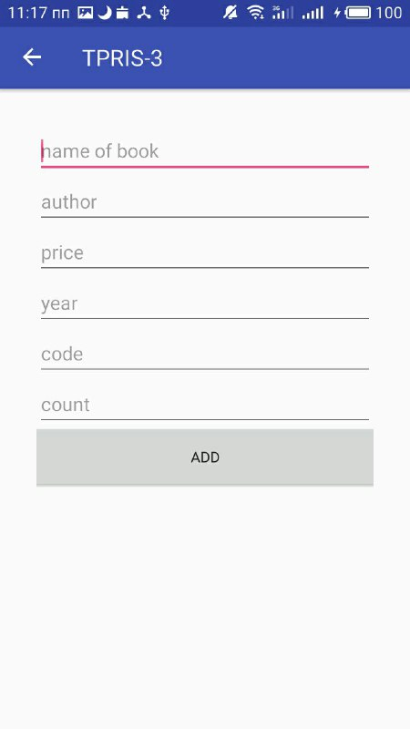
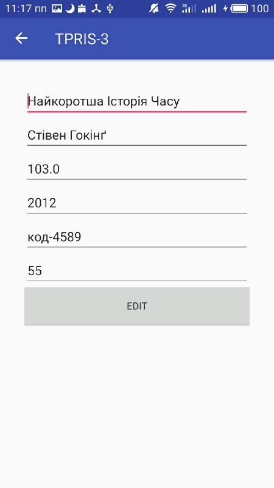
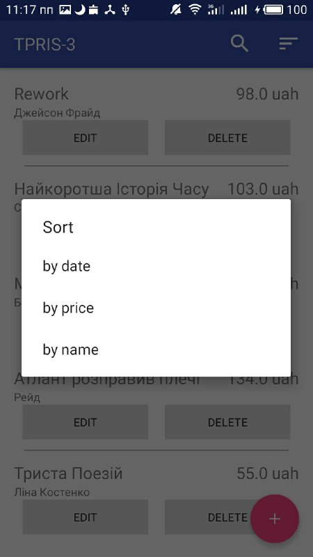
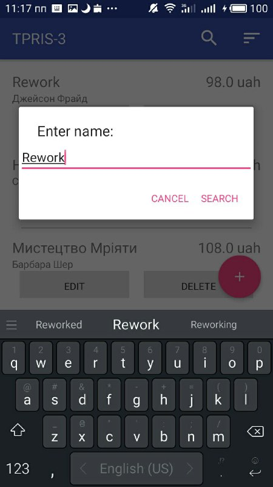

# BookManager
lab 3 TPRIS

A simple CRUD app using Firebase for university laboratory work.

## Features
* Create book
* Edit book
* Delete book
* Sort books by properties
* Search books by name

## Screenshots
List of books | Create book | Edit book
-------------|----------------- | -------------
  |  | 

Sort books | Search books
-------------|-------------
  |  

## License
This application is Free Software ([GNU General Public License](https://www.gnu.org/licenses/gpl.html))
The weather data, list of cities and icons is provided by [OpenWeatherMap](https://openweathermap.org/), under the <a href='http://creativecommons.org/licenses/by-sa/2.0/'>Creative Commons license</a>.
